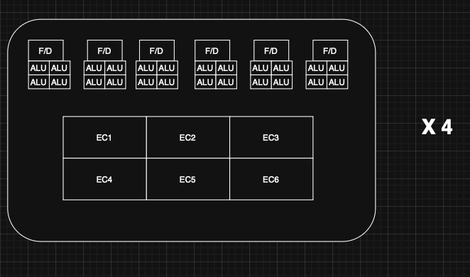
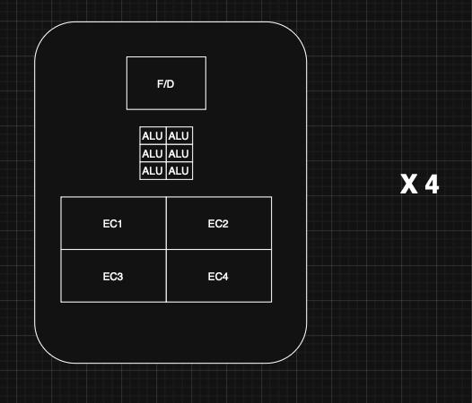
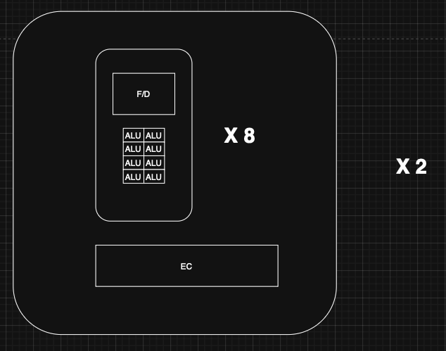
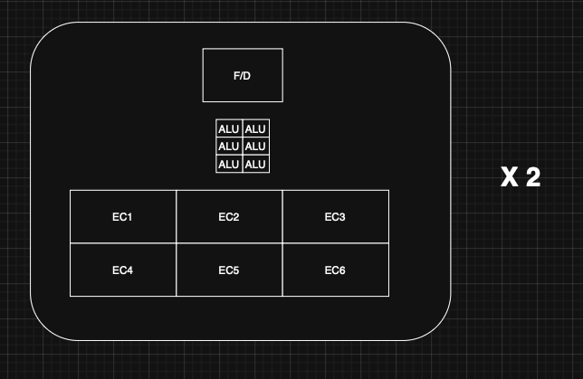

# Assignment 3

Josh Green and Akhil Sankar
Group 04

## Problem 1

Assume the following instruction stream is given:

```
for (int x = 0; x < dimX-1; x++) {
    for (int y = 0; y < dimY-1; y++) {
        for (int z = 0; z < dimZ-1; z++) {
            int index = x * dimY * dimZ + y * dimZ + z;
            if (y > 0 && x > 0) {
                solid = idx[index];
                    dH1 = (Hz[index] – Hz[index-incY])/dy[y]; //1 subtraction, 1 division, 2 FLOPS total
                    dH2 = (Hy[index] – Hy[index-incZ])/dz[z]; //1 subtraction, 1 division, 2 FLOPS total
                    Ex[index] = Ca[solid]*Ex[index]+Cb[solid]*(dH2-dH1); // 1 subtraction, 2 multiplications, 1 addition, 4 FLOPS total
            }
        }
    }
}
```

`dH1`, `dH2`, `Hy`, `Hz`, `dy`, `dz`, `Ca`, `Cb`, and `Ex` are all single-precision floating-point arrays and `idx` is an unsigned integer array.

### Part 1: What is the arithmetic intensity (how many operations performed in a certain number of clock cycles) of the instruction stream/kernel?

Since we are dealing with arithmetic intensity, we will be counting FLOPS and bytes

Let's consider the inner loop first:
* When the condition is satisfied, there are 8 FLOPS
* idx[index] is accessed once (4 bytes)
* Hz[index] and Hz[index-incY] are both accessed (8 bytes)
* Hy[index] and Hy[index-incZ] are both accessed (8 bytes)
* dy[y] and dz[z] are both accessed (8 bytes)
* Ca[solid] and Cb[solid] are both accessed (8 bytes)
* Ex[index] is accessed once (4 bytes) and written once (4 bytes). Therefore, it is 8 bytes total
The inner loop involves 44 bytes of data movement and 8 FLOPS. Therefore, the arithmetic intensity of the inner loop (worst case scenario) is `8 FLOPS`/`44 bytes` = `0.1818 FLOPS/byte`

By calculating the worst case scenario inner loop arithmetic intensity, we can assume that the overall arithmetic intensity of the entire kernel is also `0.1818 FLOPS/byte` since the non-worse case scenario will only result in less operations being performed.


### Part 2: Is this instruction stream/kernel amendable to vector or SIMD execution? Why or why not?

The code is friendly to SIMD execution, especially within the inner loop. Different iterations of the inner loop are independent of each other, meaning that they can be executed in parallel. Furthermore, the data strides in the inner loop would be consistent, further facilitating SIMD operation.

The outer loop is also possible to parallelize, but it would be preferable to use threads. Assign each thread an `(x, y)` pair, and have the thread iterate over `z`. This would ensure that each thread is working on contiguous memory locations, which is more cache friendly.

### Part 3: Assume this kernel is to be executed on a processor that has 30 GB/sec of memory bandwidth. Will this kernel be memory bound or compute bound?/

This process would be memory bound. The low arithmetic intensity indicates that we would need a lot of memory bandwidth to keep the processor busy. In order to compute 1 FLOP, we would need 5.5 Bytes of memory bandwidth. Therefore, with 30 GB/sec of memory bandwidth, we would be able to perform `30 GB/sec / 5.5 Bytes/FLOP = 5.45 GFLOPS`. This is a relatively low number, indicating that the processor would be waiting on memory access most of the time.

## Problem 2

Let’s now consider the following chip architectures:

- a) 4 core, 4 SMT, 4-wide SIMD capability
- b) 4 core, 2 interleaved/temporal Multithreading, 16-wide SIMD capability
- c) 2 core, 4 interleaved/temporal Multithreading, 16-wide SIMD capability
- d) 4 core, 8-way ILP, 4-wide SIMD capability
- e) 2 core, 8 interleaved/temporal multithreading, 8-wide SIMD capability
- f) 8 core, 2 SMT, 2-wide SIMD capability

### Question: Which are the top TWO architectures (out of SIX in total) better suited for a program with the following characteristics and why: Heavy in computations program. Takes input of 1024 array elements. Each element is a measure of “sunlight” sampled exactly every 30 minutes on a city exactly on the Earth’s equator. The result is a positive number when the sun is observed (day) and a negative number when the sun is not observed (night). The program is divergent and also exposes a lot of data re-use. Non-negative elements x[i] follow a heavy computational branch, while negative elements x[i] conduct the following calculation: y[i] = y[i] / x[i].

CPUs `d` and `f` are the best suited for this program. 
Note that the program is heavy in computations, divergent, and has a lot of data re-use. 

With a heavy computational workload, ILP will be the most beneficial. As we compute many different branches, we will see a heavy divergence in the instruction streams, making SIMD not as effective. Furthermore, the large amount of data re-use would be diluted by using multiple threads. 

Due to the parallelism of CPU `d` being primarily from the 8-Way ILP, it would be the best suited for this program. CPU `f` would be the second best, as it's low SMT count would help reduce cache thrashing and it's low SIMD width would help reduce the impact of divergence when compared to the other CPUs.

## Problem 3

### Question 1: Diagrams of the different CPU organizations

• Functional Units: Fetch/Decode units (abbreviated F/D unit here)

• SIMD: To support SIMD (single instruction, multiple data), the same instruction encoded in the F/D unit can be executed in parallel for multiple instances of data. Thus, each ALU associated with a F/D unit can execute the instruction for a given instance of data. An 8-way SIMD executes the same instruction for 8 different instructions, using 8 ALUs.

• Instruction level parallelism (ILP): can be achieved when a core has multiple F/D units. The compiler identifies independent instructions in an instruction stream and executes them in parallel using these F/D units. The same ILP processing capability can be provided through various physical architectures.

• Execution Context (EC):
    - Individual: each ALU gets its own data registers and local state
    - Shared: all ALUs share the instruction stream and control flow
    - Each TMP/SMP thread gets its own EC

#### **A: 4 Core, 6 Simultaneous Multithreading, 4-Wide SIMD Capability**

Functional Units: 4 cores x 6 F/D unit / core = 24 F/D units
ALUs:  4 cores x 6 F/D units x 4 ALUs = 96 ALUs
ECs: 4 cores x 6 ECs/core= 24 ECs


[CPU A Diagram](./images/CPU_A.png)

#### **B: 4 core, 4 interleaved/temporal Multithreading (TMP), 6-wide SIMD capability**

Functional Units: 4 cores x 1 F/D unit / core = 4 F/D units
ALUs:  4 cores x 1 F/D unit x 6 ALUs = 24 ALUs
ECs: 4 cores x 4 ECs/core = 16 ECs



[CPU B Diagram](./images/CPU_B.png)

#### **C: 2 core, 8-way Instruction Level Parallelism (ILP), 8-wide SIMD capability**

Functional Units: 2 cores x 8 F/D unit / core = 16 F/D units
ALUs:  2 cores x 8 F/D units x 8 ALUs = 128 ALUs
ECs: 2 cores x 1 ECs/core = 2 ECs



[CPU C Diagram](./images/CPU_C.png)
#### **D: 2 core, 6 interleaved/temporal multithreading, 6-wide SIMD capability**

Functional Units: 2 cores x 1 F/D unit / core = 2 F/D units
ALUs:  2 cores x 1 F/D unit x 6 ALUs = 12 ALUs
ECs: 2 cores x 6 ECs/core = 12 ECs



[CPU D Diagram](./images/CPU_D.png)


### Question 2:

#### 1. How many simultaneous & concurrent instruction streams can we support in each?

- 4 core, 6 Simultaneous Multi Threading, 4-wide SIMD capability
    - simultaneous IS: 4 core x 6 IS/core = 24 IS
    - concurrent IS    : 4 core x 6 SMP/core  = 24 IS
    - If any of the 6 instructions stall, concurrency < 24 IS

- 4 core, 4 interleaved/temporal Multithreading (TMP), 6-wide SIMD capability
    - simultaneous IS: 4 core x 1 IS/core = 4 IS 
    - concurrent IS    : 4 core x 4 TMP/core = 16 IS

- 2 core, 8-way Instruction Level Parallelism (ILP), 8-wide SIMD capability
    - simultaneous IS: 2 core x 1 IS/core = 2 IS 
    - concurrent IS    : 2 core x 1 thread/core = 2 IS

- 2 core, 6 interleaved/temporal multithreading, 6-wide SIMD capability
    - simultaneous IS: 2 core x 1 IS/core = 2 IS 
    - concurrent IS    : 2 core x 6 thread/core = 12 IS 

#### 2. What is the size of the registers in the execution contexts of each chip?

Each core has 32 registers of 64 bits each, forming a native execution context for that core. These registers are then accessed as vectors to provide parallel access to an array of registers within the same read instruction, supporting SIMD parallelism. 

Thus:

- 4-wide SIMD: 4x64 = 256 bit-vector registers
- 6-wide SIMD: 6x64 = 384 bit-vector registers
- 8-wide SIMD: 8x64 = 512 bit-vector registers
- 6-wide SIMD: 6x64 = 384 bit-vector registers

#### 3. Which of (b, c, d) offers max latency reduction? Which offers the minimum?

(d) provides the most number of threads per core. This is better for latency reduction since there are more execution contexts available to swap into, upon hitting a memory stall. Conversely, while (c) offers 8 way ILP, it is only single threaded. Suppose all 8 ILP instructions perform I/O. In this instance, the CPU would idle until one of the instructions returns. This is the worst case for latency reduction and overall CPU utilization. 

#### 4. How many work units to maximize latency hiding? Compare c and d and justify.

In order to maximize latency hiding, the maximum number of available threads should be concurrently exercised per core such that the CPU should minimize idling.  

- a) 4 core, 6 Simultaneous Multi Threading, 4-wide SIMD capability
    - 4 cores x 6 SMT instructions can be simultaneously executed = 24 simultaneous instructions. Ideally, these are executed for 4 work units each (SIMD), yielding 24 x 4 = 96 work units being concurrently processed. 

- b) 4 core, 4 interleaved/temporal Multithreading (TMP), 6-wide SIMD capability
    - 4 cores x 4 TMP instructions can be simultaneously executed = 16 concurrent instructions.  Through SIMD, these are executed for 6 work units each, yielding 16 x 6 = 96 work units being concurrently processed. 

- c) 2 core, 8-way Instruction Level Parallelism (ILP), 8-wide SIMD capability
    - 2 cores x 1 thread/core yields a maximum of 2 concurrent threads across the processor. Through SIMD, this chip can only process 2 x 8 = 16 work units concurrently. 

- d) 2 core, 6 interleaved/temporal multithreading, 6-wide SIMD capability
    - Similar to earlier examples, to maximize latency hiding, we need 2 cores x 6 TMP instructions/core x 6 ALUs = 72 working units concurrently. 


Comparing (c) and (d), we observe that (d) offers significantly more multi-threading as opposed to the 8-way ILP processing that (c) offers. Latency hiding is dependent on context swaps to a different unblocked thread during memory stalls. Thus, (d) provides a significantly better concurrent throughput (assuming the two are running the same program which includes stalls). 


#### 5 and 6. For which chips would the compiler do the most and least work respectively?

The compiler for (c) would need to work the hardest to find sections of the instruction stream that could be parallelized to saturate a chip that can support 8-way ILP. Alternatively, each core in (b) can only support 1 instruction anyway, so the compiler does not even need to look for ILP in the program. 

#### 7. For what programs would (b) perform better than (d)? What about (d) vs (b)?

Recall: 

- (b) 4 core, 4 interleaved/TMP, 6-wide SIMD
- (d) 2 core, 6 interleaved/TMP, 6-wide SIMD

(b) includes more cores but supports less multithreading. This lends itself more to programs that cause fewer stalls (ex: fetch/writebacks to main memory). Programs that exhibit more ILP or a higher ratio of backend to frontend instructions run faster on (b). In other words, programs that lend themselves to more continuous CPU utilization will perform better. 

(d) includes fewer cores. Thus, it is less capable than (b) for pure parallel computation with minimal memory stalls. However, for programs with more I/O or other types of memory stalls, each core offers 2 more threads. In the event of lots of blocking calls, more threads can perform better latency hiding, improving CPU utilization over (b). 


#### 8. Suppose we run a program with high temporal locality. Do we want:

- Large cache and no/few threads?
- small/no cache by many hardware threads?
- Large cache, many hardware threads?

High temporal locality indicates that the same data is being read multiple times in a short time interval. To avoid I/O reads/writes causing huge memory stalls, the processor should primarily read and write to cache. This reduces memory stalls to a handful of clock cycles per read/write. 

For a program with high temporal locality, the larger the cache, the better the payoff to perform read/write operations (effectively, cache gets hit much more than main memory). 

Since memory stalls are much shorter, CPU utilization increases. Threading is primarily implemented to hide latency caused by memory stalls. Thus, fewer threads can be implemented, allowing for larger execution contexts per thread. 

With many hardware threads but a smaller cache, only a smaller subset of temporally local data can be stored at any one time. This would necessitate more calls to main memory. Threading would not help with this issue, as each thread would simply issue more calls to main memory due to continued cache misses. 

Once again, because threading only improves throughput through latency hiding, it is only helpful for an application with many calls to main memory. With a large cache, the CPU would not be stalled for very long, so its utilization might already be saturated. Adding more threads would have no effect on throughput.

## Problem 4

Consider the following three CPU organizations:
- **CPU SS**: A two-core supserscalar microprocessor that provides out-of-order issue capabilities on two FUs. Only a single thread can run on each core at a time.
- **CPU MT**: A fine-grained multithreaded processor that allows instructions from two threads to be run concurrently (i.e., there are two functional units), though only instructions from a single thread can be issued on any cycle.
- **CPU SMT**: An SMT processor that allows instructions from two threads to be run concurrently (i.e., there are two functional units), and instructions from either or both threads can be issued to run on any cycle.

Assume we have two threads `X` and `Y` to run on these CPUs that include the following operations:

| Thread X | Thread Y |
|----------|----------|
| A1: takes 3 cycles to execute | B1: takes 2 cycles to execute |
| A2: no dependencies | B2: conflicts for a functional unit with B1 |
| A3: conflicts for a functional unit with A1 | B3: depends on the result of B2 |
| A4: depends on the results of A3 | B4 : no dependencies and takes 2 cycles to execute |

Assume all instructions take a single cycle to execute unless noted otherwise or they encounter a hazard.

### Question 1: Assume that you have one SS CPU. How many cycles will it take to execute these two threads? How many issue slots are wasted due to hazards?

Since we have two cores, we can run both threads in parallel (one on each core). Furthermore, each core has two FUs to work with.

For Core 1 (Thread X):

FU1 spends 3 cycles on A1.
FU2 can execute A2 in parallel with A1, taking 1 cycle.
A3 must wait for A1 to finish, so A3 will occur on FU1 at cycle number 4, taking 1 cycle.
A4 must wait for A3 to finish, so A4 will occur on FU1 at cycle 5, taking 1 cycle.

Therefore, Thread X will take 5 cycles to complete. There are 4 cycles wasted where FU1 is doing work while FU2 is idle

| Cycle | FU1       | FU2       |
|-------|-----------|-----------|
| 1     | A1 (1/3)  | A2 (1/1)  |
| 2     | A1 (2/3)  | Idle      |
| 3     | A1 (3/3)  | Idle      |
| 4     | A3 (1/1)  | Idle      |
| 5     | A4 (1/1)  | Idle      |   

For Core 2 (Thread Y):
FU1 spends 2 cycles on B1.
B2 needs to wait for B1 to finish, so B2 will occur on FU1 at cycle number 3, taking 1 cycle.
B3 needs to wait for B2 to finish, so B3 will occur on FU1 at cycle number 4, taking 1 cycle.
B4 has no dependencies, and can be run on FU2 in parallel with the other instructions.

Therefore, Thread Y will take 4 cycles to complete. There are 2 cycles wasted where FU1 is doing work while FU2 is idle.

| Cycle | FU1       | FU2       |
|-------|-----------|-----------|
| 1     | B1 (1/2)  | B4 (1/2)  |
| 2     | B1 (2/2)  | B4 (2/2)  |
| 3     | B2 (1/1)  | Idle      |
| 4     | B3 (1/1)  | Idle      |

In total, we have 6 wasted slots (4 from Thread X and 2 from Thread Y). Since Thread X takes longer to complete, the total number of cycles to execute both threads is 5 cycles.

### Question 2: Now assume you have two SS CPUs. How many cycles will it take to execute these two threads.

Adding additional CPUs does not help in this case, since we only have two threads to execute and a single SS CPU was already able to execute both threads in parallel. Therefore, the total number of cycles to execute both threads remains 5 cycles.

### Question 3: Assume you have one MT CPU. How many cycles will it take to execute these two threads? How many issue slots are wasted due to hazards?

| Cycle | Issuing Thread | FU1      | FU2      |
| ----- | -------------- | -------- | -------- |
| 1     | X              | A1 (1/3) | Idle     |
| 2     | Y              | A1 (2/3) | B4 (1/2) |
| 3     | —              | A1 (3/3) | B4 (2/2) |
| 4     | Y              | B1 (1/2) | Idle     |
| 5     | X              | B1 (2/2) | A2 (2/2) |
| 6     | X              | A3 (1/1) | Idle     |
| 7     | X              | A4 (1/1) | Idle     |
| 8     | Y              | B2 (1/1) | Idle     |
| 9     | Y              | B3 (1/1) | Idle     |


In total, we have 6 wasted slots and can run the two threads in 9 cycles, mainly due to the fact that we can only issue instructions from one thread at a time.

### Question 4: Assume you have one SMT CPU. How many cycles will it take to execute these two threads? How many issue slots are wasted due to hazards?

| Cycle | FU1       | FU2       |
|-------|-----------|-----------|
| 1     | A1 (1/3)  | B1 (1/2)  |
| 2     | A1 (2/3)  | B1 (2/2)  |
| 3     | A1 (3/3)  | B2 (1/1)  |
| 4     | A3 (1/1)  | B3 (1/1)  |
| 5     | A4 (1/1)  | B4 (1/2)  |
| 6     | A2 (1/1)  | B4 (2/2)  |

In total, we have 0 wasted slots and can run the two threads in 6 cycles.