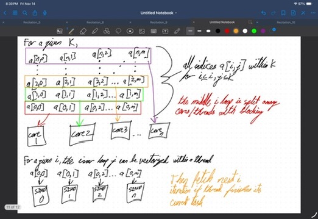
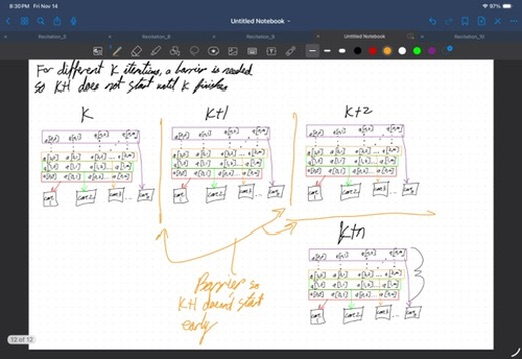

```c
/* Do here all proper initializations. */

for (k = 0; k < N; k++)
        for (i = k+1; i < N; i++) {
                l = a[i][k] / a[k][k];

                for (j = k+1; j < N; j++)
                        a[i][j] = a[i][j] - l * a[k][j];
        }

```

## Qp1 (4 points)

Design and sketch a parallel program to execute the above computational kernel on a multi-core platform
that supports a shared address scheme. You may provide two different solutions: one focusing on task parallelism
and another focusing on data parallelism.

Inner loop

- Operation: `a[i][j] = a[i][j] - l * a[k][j]`
- `l` is calculated beforehand and `k` is kept fixed for the inner loop; only `j` changes.

Parallelism for inner loop

- SIMD: Safe to implement without race conditions because each iteration updates a different element.
    - `a[i][j], a[i][j+1], ...` are contiguous in memory, which gives good spatial locality.
    - There are no dependencies between elements in the inner loop (only dependency on `l`).
- Multi-core: Also possible, but SIMD is a more natural fit since the operations are the same and only the data changes.

Middle loop

- `k` is fixed for the whole middle loop (which calls the inner loop for each `i`).
- `i` increments each iteration.
- `l = a[i][k] / a[k][k]`
    - Since `k` is fixed, `a[k][k]` is fixed, so `l` depends only on `i`.

Parallelism for middle loop

- SIMD: Not directly applicable because `l` changes between iterations (would require vectorizing `l` values).
- Multi-core (task-level): Each iteration (value of `i`) can be executed by a different core. Each core computes
    its `l` and executes the inner loop (which itself can use SIMD). This enables latency hiding and better cache use
    because each core can work on one row `i` and keep its data in local caches.

Outer loop

- For k = 0: rows i = 1,2,3,...,N are updated.
- For k = 1: rows i = 2,3,4,...,N are updated.
- For k = 2: rows i = 3,4,5,...,N are updated.

Note: Each outer iteration depends on the updated matrix `a` from the previous iteration `k-1`. Therefore the outer
loop cannot be parallelized and must remain sequential.





## Qp2 (2 points)

Follow the task-parallel logic and sketch the dependencies. What strategies help achieve maximum speedup?

- Use data-level parallelism (SIMD) for the inner loop.
- Use task-level parallelism (multi-core threads) for the middle loop (assign different `i` values to different cores).
- Keep the outer loop sequential.

This hybrid scheme (SIMD inside each core, multi-threading across rows) gives the best combined utilization of vector
units and cores while preserving correctness.



## Qp3 (2 points)

Identify where synchronization is required and which mechanisms to use.

- The outer loop must run sequentially; each iteration `k` depends on the completion of iteration `k-1`.
- Use a barrier at the end of each outer iteration to ensure all work for that `k` is finished before proceeding to `k+1`.
    - Barriers are simple and effective here because all threads must wait for the updated matrix state.
- Locks are not required for inner-loop element updates if each thread/core works on distinct elements. If work-stealing
    or dynamic assignments lead to potential overlap, use fine-grained locks or atomic updates on affected elements.


## Qp4 (2 points)

If we are given M processors/cores/threads to distribute the computations of the elements of this grid, which
assignment strategy should we use: blocked or interleaved? Why?

Assumptions

- Multi-core, multi-threaded system with multi-way SIMD per core.

Innermost loop (data layout and assignment)

- Memory layout (row-major) example:

            0x00    a[0][0]
            0x01    a[0][1]
            0x02    a[0][2]
            ...
            0x0n    a[0][n]
            0x0(n+1) a[1][0]

- A vector instruction fetches a contiguous block of memory into cache lines, giving high spatial locality.
- With a 4-way SIMD unit, each lane processes one element from the cache line in lockstep. This interleaved
    assignment (vector lanes working across consecutive elements) is efficient because it uses contiguous memory.

Blocked vs Interleaved

- Interleaved assignment (assign contiguous columns to vector lanes) is preferred for the inner loop because it
    matches memory layout and maximizes memory bandwidth usage and cache efficiency.
- Blocked assignment (giving whole blocks to different threads) can be useful at the row/task level (assigning rows
    or ranges of rows to different cores) but for vectorization the interleaved approach is better.

Throughput improvements

- Use SIMD for the inner loop (interleaved across columns) and multi-threading across the middle loop (rows `i`).
- Optionally use thread-level interleaving to hide memory latency by switching between threads when waiting for memory.

Middle loop

- Use M cores to process different `i` values in parallel; each core computes `l` for its row and performs SIMD updates
    for the inner loop.

