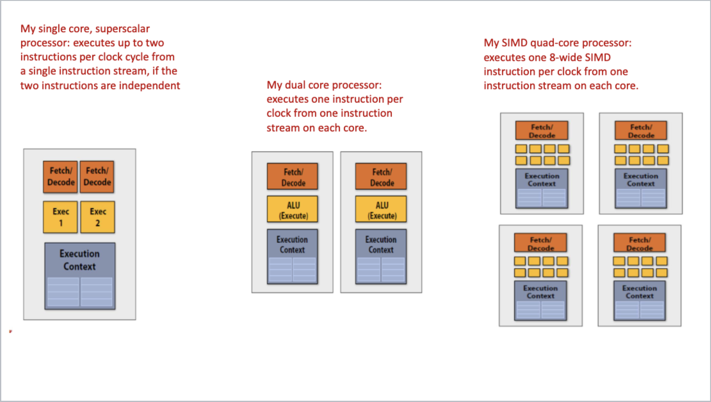

# Lecture 5: SIMD Execution on modern CPUs

Instructions are generated by the Compiler
- Parallelism explicity given by programmer using intrinsics
- Parallelism conveyed using parallel language semantics (e.g., `forall` example)
- Parallelism infered by dependency analysis by auto-vectorising compiler (best compilers not great at this)

## Explicit SIMD

SIMD parallelization is performed at compile time
- Can inspect program binary and see instructions (`vstoreps`, `vmulps`, etc.)
    - `ps` suffix means packed scalar

## Intrinsic Functions
Build-in functions
- Know by compiler that directly maps sequences/commands to assembly.
- Compiler implements directly
- "Instrinsics" are features of a language that compiler recognizes

## Parallel Execution Summary

A summary of parallel execution in modern processors:
- Multi-core: use multiple cores
    - Provides thread-level parallelism: simultaneously execute completely different instruction stream on each core
- SIMD: user multiple ALUs controlled by same instruction stream (within a core)
    - Efficient for data parallel work-threads: control amortized over many ALUs
    - Vectorization can be done by compiler or at runtime by hardware
    - [Lack of] dependeices is known prior to execution (declared by programmer or inferred by loop analysis by advanced compiler)
- Superscalar: Exploit ILP. Process different instructions from the same instruction stream in parallel (within a core)
    - Parallelism automatically and dynamically discovered by the hardware during execution (not programmer visible)

### Question: What is the speedup from each parallel execution given 1000 iterations with 4 instructions
- Single core superscalar that executes 2 instructions per clock cycle: `500 cycles`

- Dual core processor that executes one instruction per clock from one instruction stream on each core: `500 cycles`
