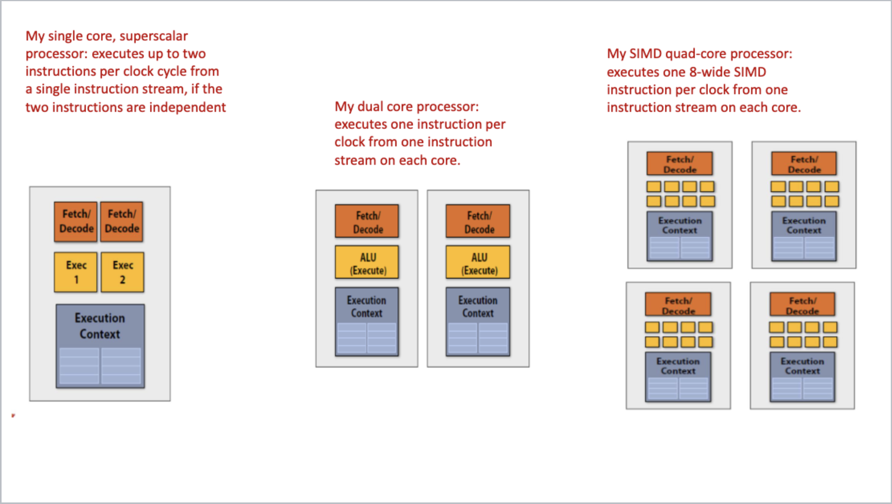
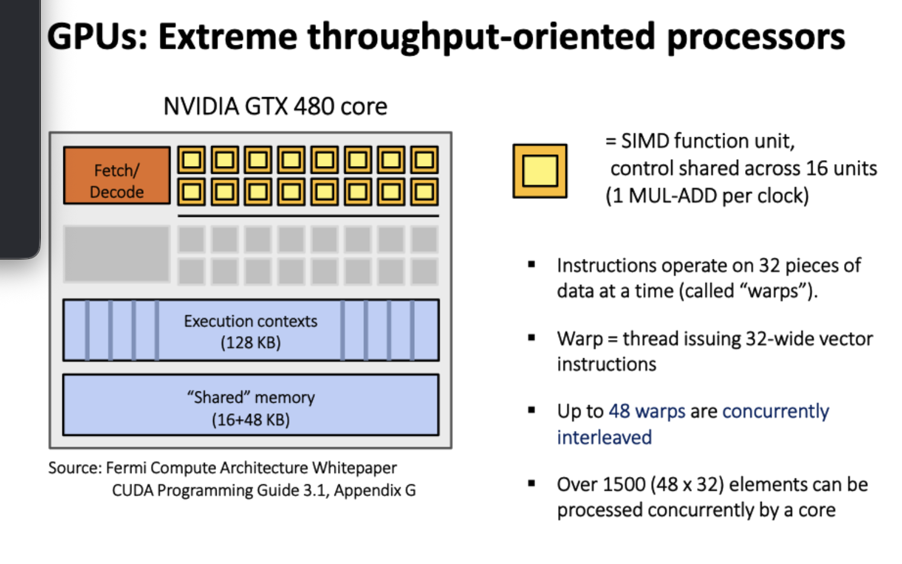

# Lecture 9

Let's consider a CPU

[Fictitious CPU](./fictitiousCPU.png)

This CPU can perform SMT: 
- It has 8 ALUs per core, 16 cores, and 4 threads per core.
  - `8 ALUs/core * 16 cores * 4 threads/core = 512 ALUs total`
- We have 8 SIMD ALUs per core, so we can support 8-wide SIMD instructions.
- To maximize latency hiding, we need to run 512 pieces of work concurrently in order to keep all ALUs busy.

## GPUs

GPUs are throughput-oriented processors

[GPU Architecture](./gpu.png)

- GPU instructions are operated on 32 pieces of data at a time (called a "warp").
- up to 48 warps are concurrently interleaved
- over 1500 elements can be processed concurrently


## CPU vs GPU memory hierarchy

CPUs have big caches, few threads, modest memory bandwidth. Mainlyl rely on caches and prefetching to hide memory latency.

GPUs have small caches, many threads, huge memory bandwidth. Rely on massive multithreading to hide memory latency.

### Thought Experiment

Given a task of element-wise multiplication of vectors A and B
- Assume Vectors contain millions of elements

```
load input A[i]
load input B[i]
Compute A[i] * B[i]
Store result into C[i]
```

We have three memory operations for a single multiplication operation. Our GPU (Nvidia GTXz 480) can do 480 Multiplications per clock cycle at 1.2 GHz
- We need 6.4 TB/s memory bandwidth to keep the Functional Units busy, but we only have 177 GB/s memory bandwidth.

Edn result: we have about a 3% efficiency, but 7 times speedup over CPU